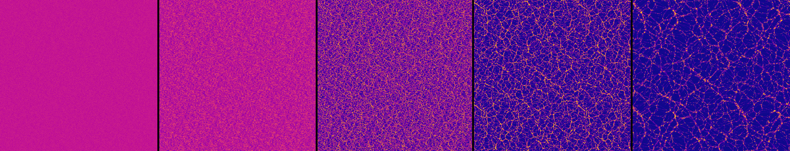
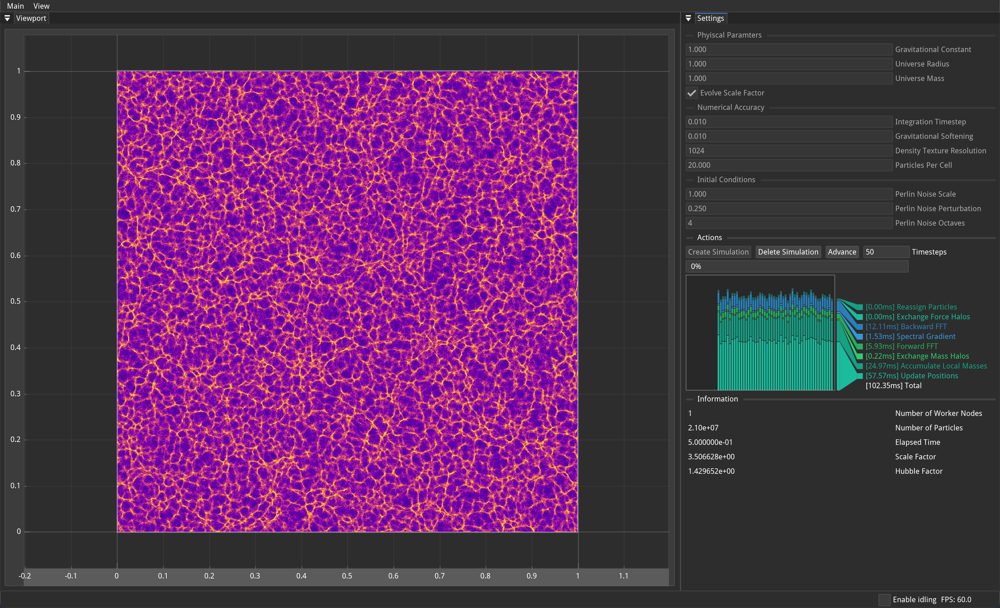

# Large-Scale Gravity Simulator with MPI/OpenMP

(Solo Final Project for CS2050 at Harvard)

Large-scale cosmological simulations are an indispensable tool for cosmologists testing theories of structure formation. In the current standard model of cosmology, the universe begins almost perfectly uniformly, with tiny density perturbations seeded by inflationary expansion. In an expanding universe and under the influence of gravity, these small initial inhomogeneities are magnified into a large-scale web of galaxy clusters and voids. Such simulations are typically very computationally expensive, both from a compute and memory perspective, and so are an excellent candidate for massive parallelization.



In this project, I implement a two-dimensional particle-mesh (PM) solver that follows only the collision-less dark-matter component in a flat expanding universe with periodic boundary conditions. Tracer particles sample the fluid; their masses are deposited on a uniform square grid with cloud-in-cell assignment. Poisson’s equation for the gravitational potential is solved spectrally, and the resulting forces drive a leap-frog update of particle positions and velocities. The repository exposes two front-ends. The CLI is always built and is intended for scripted or batch runs on HPC systems. The optional GUI application embeds the core library in an ImGui wrapper that allows for tweaking simulation parameters to see updates in real time. Both executables link against the exact same simulation engine, guaranteeing identical numerical results.



## Parameters

| Parameter | Description | Typical Values / Default |
|-----|-------------|-------------------------|
| `GRAVITY` | Newton's gravitational constant. | `1.0` |
| `MASS` | Total mass in the universe. | `1.0` |
| `RADIUS` | Physical box size (the side length of the periodic square). | `1.0` |
| `SOFTENING` | Plummer softening (comoving) length that caps the gravitational force at small separations. | `0.01` |
| `TIMESTEP` | Time increment for the leap-frog integrator.  | `0.01 - 0.001 `|
| `RESOLUTION` | Number of mesh cells per axis. | `256 – 2048` |
| `USE_SCALE_FACTOR` | Whether or not to evolve the cosmological scale factor by the 2d Friedman equations. | `true` |
| `PERLIN_NOISE_SCALE` | Characteristic wavelength of the initial Perlin-noise perturbation. | `16 – 128` |
| `PERLIN_NOISE_PERTURBATION` | Amplitude of the initial fractional density fluctuation. | `0.05 – 0.2` |
| `PERLIN_NOISE_OCTAVES` | Number of octaves in the Perlin spectrum; higher values add small-scale structure. | `1 – 6` |
| `PARTICLES_PER_CELL` | Sampling density of tracer particles initially placed in each mesh cell. | `5 – 20` |

## Building/Running CLI 

### Mandatory dependencies

| Package | Version tested | Notes |
|---------|----------------|-------|
| [Git](https://git-scm.com) | 2.40+ | source checkout |
| [CMake](https://cmake.org) | ≥ 3.21 | configure & build system |
| C++20 compiler | GCC 11 / Clang 14 / MSVC 19.3 | must support OpenMP |
| [Open MPI](https://www.open-mpi.org) | 4.x | mpirun` |
| OpenMP | bundled with compiler | runtime threading |
| [FFTW](http://www.fftw.org) | 3.3.x compiled **with** `--enable-mpi` **and** `--enable-openmp` | double-precision build |

### Quick build

```bash
git clone https://github.com/LevKruglyak/CS2050-Final.git
cd CS2050-Final
cmake -B build -S . -DCMAKE_BUILD_TYPE=Release
cmake --build build -j
```

### Running the CLI

After building, the command-line executable lives at `build/lkxpm`. Note that the executable must be launched by ```mpirun``` with at least 2 ranks. 

| Flag            | Argument  | Default | Purpose                                                                      |
|-----------------|-----------|---------|------------------------------------------------------------------------------|
| `--config`      | `<file>`  | *none*  | JSON parameter file. Compiled-in defaults if absent |
| `--iterations`  | `<int>`   | `1000`  | Number of leap-frog time-steps                                               |
| `--save-freq`   | `<int>`   | `100`   | Write a PNG snapshot every *N* steps                                         |
| `--out-prefix`  | `<string>`| `density`| Base name for output images          |


#### Example

```json file=example.json
{
  "GRAVITY": 1.0,
  "SOFTENING": 0.01,
  "RADIUS": 1.0,
  "MASS": 1.0,
  "PERLIN_NOISE_SCALE": 1.0,
  "PERLIN_NOISE_PERTURBATION": 0.25,
  "PERLIN_NOISE_OCTAVES": 4,
  "USE_SCALE_FACTOR": true,
  "TIMESTEP": 0.01,
  "RESOLUTION": 1024,
  "PARTICLES_PER_CELL": 50
}
```

```bash
# 4 MPI ranks, 8 OpenMP threads per rank
export OMP_NUM_THREADS=8
mpirun -n 4 build/lkxpm \
       --config example.json \
       --iterations 2000 \
       --save-freq 100 \
       --out-prefix output/density
```

Note that the output directory must already exist prior to running the executable.
For some more examples, see the ```runs/``` folder.

#### Output
 * PNG frames – Greyscale surface-density images written by rank 0 at the specified frequency.
 * Timing summary – One line printed by rank 0 on exit: 
    
    ```<avg total> <avg mass-assignment> <avg poisson-solve> <avg update>```
    
    All numbers are wall-clock milliseconds averaged over the full run.

## Building and Running the APP

To enable and launch the GUI frontend, you must build the `BUILD_APP` target in your CMake configuration. This links against the [Dear ImGui Bundle](https://github.com/pthom/imgui_bundle) — a comprehensive, cross‑platform suite of Dear ImGui widgets and utilities. 

### Enabling the GUI Build  

1. In your project root, reconfigure CMake with the `BUILD_APP` option set to `ON`:  
   ```bash
   cmake -B build -S . -DCMAKE_BUILD_TYPE=Release -DBUILD_APP=ON
   ```  
2. Build both the CLI and APP executables:  
   ```bash
   cmake --build build -j
   ```  

### Running the APP  
Once built, the GUI executable (by default named `lkxpm_app`) resides somewhere `build/` (this is platform specific). See the Dear ImGui Bundle documentation for more details. Note that the app must be run with at least 2 MPI processes (one process for the UI and one process for simulation). For instance, on my local device (MacBook Pro M3), the app can be run with:
```bash
mpirun -n 2 ./build/lkxpm_app.app/Contents/MacOS/lkxpm_app
```  
